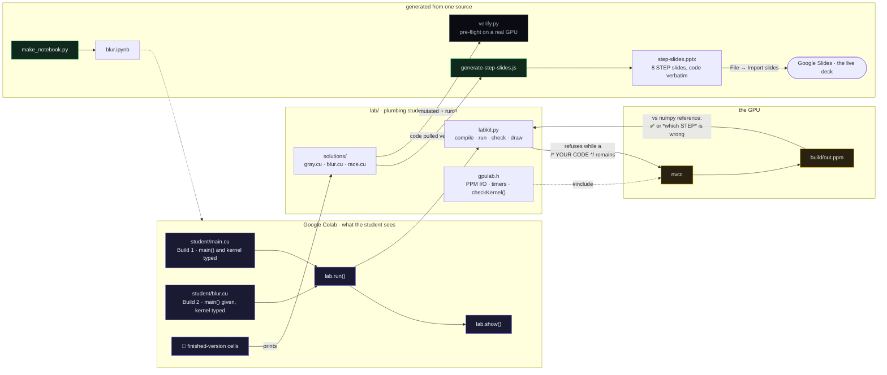

# Workshop 2 — Run Your Code on a GPU

Session 2 of the **From Zero to GPU** series. You write a program that runs on a
real GPU, changes a photo using 2.4 million threads at once, and then see why
that same shape of code is what runs a language model.

Slides (the live deck, in Google Slides):
https://docs.google.com/presentation/d/1p3c9z2zf7kZ3sfyIAIcz6V8udwOS6iddQH3RoGLokRE/edit?usp=sharing

---

## Start — one click

[](https://colab.research.google.com/github/daryl-888/Workshop2/blob/main/blur.ipynb)

1. **Click the badge.** The notebook opens in Google Colab — a free GPU in your
   browser, nothing to install.
2. **Turn the GPU on:** Runtime → Change runtime type → **T4 GPU** → Save.
3. **Run the setup cell**, then follow along.

The setup cell downloads this repo for you, so the photo and the support files
are already there. No uploads.

> **Facilitators:** the one-click flow needs this repo to be **public** — Colab
> has no GitHub login. See [FACILITATOR.md](FACILITATOR.md).

---

## The session

Roughly **30 minutes of slides, then 30 minutes of live coding** — the
facilitator builds each program while everyone follows along in their own copy.
Nothing is a puzzle; every cell is either typed together or just run.

| § | What | You do |
|---|---|---|
| 1 | Two computers in one box | read — CPU vs GPU, separate memory, the five steps |
| 2 | **Build 1: greyscale** | type all of `main()` and the kernel into `student/main.cu` |
| 3 | **Build 2: blur** | new file, `main()` already written; copy the blur kernel from the slide |
| 4 | CPU vs GPU, timed | run it; see where the time actually goes |
| 5 | What this has to do with ChatGPT | blur → matrix multiply → language models |

**Build 1 is typed from an empty `main()`** — setup, `cudaMalloc`, both
`cudaMemcpy`s, the `dim3` grid and the `<<< >>>` launch, `cudaFree`,
`return 0`, and the kernel body. Each piece has a STEP slide with the exact
lines on it. **Build 2 is a second file with that same `main()` already
written**; students copy only the blur kernel from its slide, and see for
themselves that the host code didn't change. Under each build is a collapsed
🛟 **finished version** cell.

`lab.run()` checks Build 1 and `lab.run("blur")` checks Build 2; when something
is wrong it names the step: a `cudaMemcpy` with the wrong
direction, a missing copy back (black picture), row and column swapped in the
kernel, edges divided by 49 instead of the neighbour count.

---

## How the pieces fit

Everything the student touches is on the right; everything that keeps it honest
is on the left. The code on the STEP slides, the 🛟 catch-up cells, and the
pre-flight tests all come from the same three files in `lab/solutions/`, so
they cannot disagree with each other.



---

## What's in this folder

| Path | What it is |
|---|---|
| `blur.ipynb` | the notebook — the live-coded half of the session |
| `slides/step-slides.pptx` | the 8 STEP slides that carry the typed code; import into the Google Slides deck |
| `slides/generate-step-slides.js` | generates them, pulling the code verbatim from `lab/solutions/` |
| `slides/workshop-2-gpu-llms.pptx` | the original 18-slide deck the Google Slides deck was imported from |
| `slides/generate-slides.js`, `make_assets.py` | generate that original deck and its photos |
| `lab/gpulab.h` | image loading/saving, timers, error checks (nobody edits this) |
| `lab/labkit.py` | builds and runs each program, checks the result, draws the pictures |
| `lab/solutions/` | the finished `main.cu` for each build; what the 🛟 cells print, and what the STEP slides show |
| `lab/extras/` | material cut from the session — see below |
| `lab/make_notebook.py` | generates `blur.ipynb`. Edit this, not the JSON |
| `lab/verify.py` | facilitator pre-flight: proves everything still builds and runs |
| `images/sample_1920x1280.ppm` | the photo |
| `blur_solution.cu` | the blur as one standalone file, for running outside the notebook |
| `matmul/Ch3exercises.cu` | the original PMPP Ch.3 matrix multiply, kept for the slides |

`build/` and `student/` are created at runtime and git-ignored.

### `lab/extras/`

Runnable, tested, and deliberately not in the session — they made a 30-minute
build feel like a course:

- **`demos/d_no_copyback.cu`** — forget the copy back and you get the old answer
  with no error at all
- **`demos/d_host_reads_device.cu`** — the CPU follows a GPU pointer and dies
- **`demos/d_no_guard.cu`** — what the bounds check is really protecting you from
- **`t7_matmul.cu`** — the same matrix multiply twice, where changing *which*
  memory each thread reads makes it several times faster
- **`t0`–`t3`** — standalone exercises on host/device, thread indexing, memory
  transfer and grid sizing

Good for a follow-up session, or for the student who finishes early. Build any
of them from the repo root with `nvcc -O2 -I. lab/extras/<file>.cu -o build/x`.

---

## The through-line

> **One thread per output element.**

- **Blur**: each output pixel is a sum over its neighbours.
- **Matrix multiply**: each output number is a sum of products. Same shape of
  program, different arithmetic in the middle.
- **Language models**: almost everything expensive inside one is a matrix
  multiply. One word means billions of these independent little sums.

That's the answer to "why GPUs and not CPUs" — the work is millions of identical
independent sums, which is the one thing thousands of slow cores beat a handful
of fast ones at.

---

## Run it locally instead (optional)

Any machine with an NVIDIA GPU and the CUDA Toolkit:

```bash
nvcc blur_solution.cu -o blur && ./blur     # standalone, writes output.ppm
```

Or run a program the way the notebook does, from the repo root:

```bash
nvcc -O2 -I. lab/solutions/race.cu -o build/race && ./build/race
```

The notebook's setup cell works locally too — launch Jupyter from the repo root
and it uses the checkout you already have instead of downloading one.

## A note on error checking

The student-facing programs call `cudaMalloc` and `cudaMemcpy` bare, because
wrapping every one in a check triples the line count and buries the shape while
you're still learning it. The one check that *is* there is `checkKernel()` after
each launch — that's the failure students actually hit, and without it a broken
kernel writes a silently black picture and tells you nothing.

## License
MIT.
